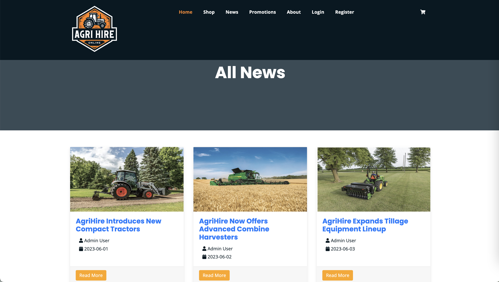

# Agrihire Shopping Web App

## Description
This repository showcases part of a school group project, a dynamic full-stack shopping web application developed for AgriHire Solutions. The app modernizes the company's equipment hire process, offering a user-friendly platform where customers can browse, book, and manage machinery rentals.

Customers can easily check equipment availability, make bookings, pay in advance, extend hires, and track their rental history. They can also communicate with staff regarding equipment, bookings, and other inquiries.

Staff and managers have access to tools for inventory management, equipment tracking, and customer support. The system also includes features for handling promotions, reporting, and equipment maintenance, ensuring a streamlined and efficient operation that meets the needs of AgriHire’s nationwide business.

## Agile Methodologies
We employed Agile methodologies throughout this project, ensuring iterative progress, continuous feedback, and adaptability to changing requirements.

As the Scrum Master, I managed task assignments, identified project dependencies, and broke down larger work items into manageable tasks. My primary focus included analyzing user requirements, designing the database, and developing key functionalities such as login and registration, user management, equipment and inventory management, set schedule, and rental checkout.

## Key Features
### 1. User-Friendly Homepage:


### 2. Role-based Dashboard:
Custom dashboards for each user role with tailored functionality.


### 3. Login/Register:
Multi-steps register with comprehensive validation.


### 4. User Management:


### 5. Equipment and Inventory Management: 
Efficiently manage over 300 types of machinery across 18 stores, with easy inventory additions that differentiate between equipment. Each inventory item and piece of equipment has a unique in-stock or serial number.


### 6. Booking Management: 
Customers can view, modify, and extend bookings, make payments, check invoices, receive notifications, and manage their accounts.


Staff, managers, and admins can manage bookings.


### 7. Reporting: 
Generates reports on finances and equipment usage.

### 8. Equipment Maintenance: 
Tracks equipment condition, service records, and availability.


### 9. Messaging System: 
Enables communication between customers and staff for inquiries and damage reporting.


### 10. Promotions and News: 


## Work Flow


## Project Layout
This Flask project uses Blueprints to organize and manage its structure effectively. Blueprints help encapsulate functionality into reusable components, such as views, templates, and other resources. This modular approach simplifies the development process and enhances code maintainability.
Here is the main structure of the project:
```bash
agrihire/
|
├── static/
|   ├── images
|   └── plugins
|
├── app/
|   ├── __init__.py
|   ├── forms
|   ├── models
|   ├── static
|   ├── templates
|   └── web
|
├── app.py
├── server.py
├── db.sql
└── pipfile
```

## Database Design
- General Design:
  - Timestamps (created_at, updated_at) track record creation and modifications for auditing and change tracking.
  - Soft deletes are enabled with the is_deleted field, allowing records to be marked as deleted without removal.
- Table-Specific Design:
  - Inventories and Equipment: Users add batches as inventory, with default location set to store 1 (national store). Each item has a unique serial number, and inventory management tracks purchase and status (active, repairing, retired).
  - Categories and Types: Categories group equipment types (e.g., tractors), with detailed fields for specifications, quantity, hire price, and period.


## Project Links
- PythonAnywhere: http://agrihire.pythonanywhere.com/
  _(Note: PythonAnywhere can be a bit slow at times. Please refresh the page if it doesn't load initially.)_
- GitHub: https://github.com/LUMasterOfAppliedComputing2024S1/COMP639S1_Project_2_Group_I

## Log-in Details for Main Roles:
- Admin: admin/abcd1234.
- staff: tom/abcd1234.
- customer: bella/abcd1234.
_(Note: While there are roles like Local Manager and National Manager, the Admin has access to all their functions, so they are not listed separately here.)_
